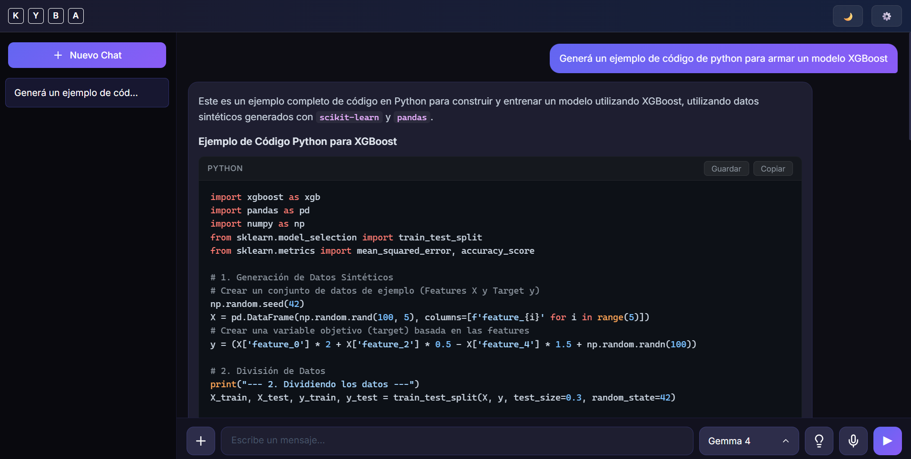
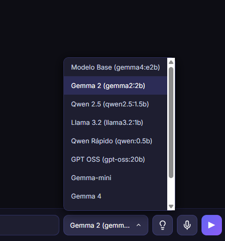
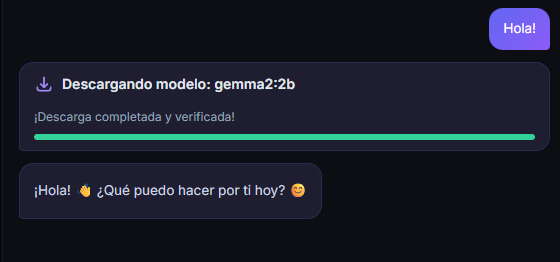
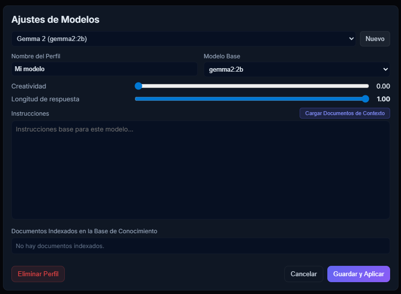

# Kyba Studio
> Ejecuta y personaliza modelos de IA (LLMs) localmente en tu PC. Rápido, privado y sin complicaciones.

Kyba Studio es una aplicación de escritorio diseñada para cambiar la forma en que trabajas diariamente con Inteligencia Artificial. Permite descargar, ejecutar y ajustar modelos de IA (como Llama, Gemma, Qwen, GPT-OSS, etc.) directamente en tu hardware local. Al no requerir conexión a la nube para el procesamiento, **garantizamos que tus datos e información sensible nunca salgan de tu equipo.**

---

## ✨ Características Principales

- **🔒 Privacidad Total:** La privacidad es nuestra prioridad. Todos los modelos y datos se procesan 100% localmente en tu máquina.
- **⚡ Rendimiento Increíble:** Optimizado para funcionar en tarjetas gráficas dedicadas de Nvidia y AMD, así como en gráficos integrados que soporten la tecnología Vulkan.
- **📦 Descarga Automática de Modelos:** Integración fluida y automática. Selecciona un modelo de la lista, hace una consulta y comenzará a descargarse solo. Una vez descargado, podes usarlo siempre que lo necesites, sin importar si tenes conexión a internet o no.
- **🎨 Personalización y RAG Integrado:** Crea modelos personalizados ajustando parámetros, instrucciones (prompts) y utilizando tus propias bases de conocimiento (documentos locales) gracias a la arquitectura RAG integrada.
- **💎 Diseño Premium:** Interfaz de usuario moderna e intuitiva.

---

## 💻 Requisitos del Sistema

### Mínimos
- **CPU:** Intel o AMD compatible con instrucciones AVX2 / FP16
- **GPU:** Nvidia, AMD o gráficos integrados Intel compatibles con Vulkan
- **RAM:** 8 GB
- **VRAM:** 3 GB

### Recomendados
- **CPU:** Ryzen series 2000 o superior, Intel Core i5 de 11ª generación o superior
- **GPU:** Nvidia series RTX 2000 o superior; AMD Radeon RX series 7000 o superior
- **RAM:** 16 GB o superior
- **VRAM:** 10 GB o superior

---

## 🛠️ Instalación y Primeros Pasos

1. Dirígete a la página de [Releases de Kyba Studio](https://github.com/kyba-repo/kyba_studio/releases).
2. Descarga la última versión del instalador (`.exe`).
3. Instala la aplicación en tu PC.
4. Al abrirla, selecciona un modelo en la barra inferior (por ejemplo, `gemma2` o `qwen`).
5. Realiza tu primera consulta. ¡El modelo se descargará automáticamente y estarás listo para trabajar!

---

## 📸 Interfaz y Uso

**Pantalla Principal**  

**Descarga Automática**  

**Creación de Modelo Personalizado / RAG**  

---

## 📄 Licencia

**Kyba Studio es gratuito para uso personal y educativo.** 
Para otros usos o consultas comerciales, por favor contacta con los creadores.

---
*Desarrollado por KYBA.*
